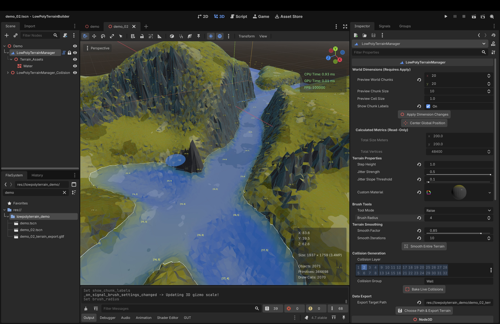

# Low Poly Terrain Builder

An intuitive, optimized, and robust 3D terrain sculpting tool tailored for creating organic low-poly landscapes inside the Godot 4 editor.

## ✅  **Update information for v1.0.10 (Make your life colorful):**
Key additions:
* brush mode dependend brush circle to directly see which mode is active plus mode label, radius and strength

## ✅  **Update information for v1.0.9 (The UI & Workflow Update):**
Version 1.0.9 introduces an overhaul of the user interface and editing ergonomics. 
Key additions:
* a horizontal viewport toolbar
* configurable hotkeys for brush tools and brush radius scaling
* a wireframe display for all polygons
* brush radius dependend activation and deactivation of chunks
	
## ✅ **Update information for v1.0.8 (Optimization):**
With v1.0.7, a very resource-intensive (GPU-heavy) default ShaderMaterial was used, causing frame drops on weaker systems. This issue has been resolved in v1.0.8. I also tested this add-on on my mobile device, achieving up to 1000 FPS within the editor.

---

## 🚀 Key Features

* **Dynamic Chunk Management:** Grid blocks are initialized inside editor RAM without cluttering `.tscn` files.
* **High-Performance Packed Arrays:** Uses `PackedFloat32Array` for `global_height_data` to maximize memory throughput.
* **Organic Delaunay Topology:** Calculates custom triangle networks on mathematically shifted vertex points.
* **Integrated Sculpting Brushes:** Includes intuitive Raise, Lower (with Shift-Invert), Flatten, Smooth, and dedicated Multi-Chunk Active/Inactive toggles.
* **Ergonomic Viewport Toolbar:** Adds a horizontal radio-button menu mapping thick, white SVG icons (`Raise`, `Lower`, `Flatten`, `Smooth`, `Activate`, `Deactivate`) that automatically adapt dark/light contrasts based on active Godot editor themes.
* **Laptop-Friendly Radius Control:** Scale your brush radius fluidly in mid-air by holding or tapping **, (Comma)** or **. (Period)** with zero 3D camera zoom interference.
* **Lightweight Editor Wireframe:** Toggles a sub-pixel vector line mesh built natively via `PRIMITIVE_LINES`, skipping pixel-shader math to ensure smooth editing on low-end integrated GPUs.
* **Production-Ready GLTF Export:** Bakes active visual chunk meshes into standalone, decoupled `.gltf` assets.
* **Lossless Grid Migration:** Safely copies height points coordinate-accurately during real-time inspector resizing.
* **Dynamic Live Physics Baking:** Instantiates persistent 3D static colliders parallel to the terrain manager, automatically skipping deactivated sectors to optimize memory.

---

## ⚙️ Inspector Configuration Parameters

| Property | Group | Type | Description |
| :--- | :--- | :--- | :--- |
| **Preview World Chunks** | World Dimensions | `Vector2i` | Map size configuration layout measured in full grid chunks (X, Z). |
| **Preview Chunk Size** | World Dimensions | `int` | Segment subdivision count per chunk. Controls localized vertex density. |
| **Preview Cell Size** | World Dimensions | `float` | Horizontal coordinate span multiplier (in meters) for grid subdivisions. |
| **Apply Dimension Changes** | World Dimensions | `Button` | Resolves Lambda Callables to migrate your height matrices safely to a new scale. |
| **Step Height** | Terrain Properties | `float` | Base vertical increment size applied per stroke during shaping. |
| **Brush Radius** | Terrain Properties | `int` | Global horizontal boundary scope of the brush. |
| **Brush Strength** | Terrain Properties | `float` | Intensity multiplier acting directly on the step height per paint frame. |
| **Jitter Strength** | Terrain Properties | `float` | Maximum random vertex displacement amount to generate the look. |
| **Jitter Slope Threshold** | Terrain Properties | `float` | Slope angle constraint. Lower values allow noise on flatter pathways. |
| **Show Deactivated Chunks** | Terrain Properties | `bool` | Toggles semi-transparent red grid boxes over disabled map coordinates. |
| **Show Wireframe** | Terrain Properties | `bool` | Toggles the low-end friendly edge preview lines across the landscape. |
| **Custom Material** | Terrain Properties | `Resource` | Inspector custom resource slot filtering out Fog/Particles. Accepts only 3D materials. |
| **Export Target Path** | Data Export | `String` | Project-relative storage directory configuration layout where the `.gltf` asset is written. |
| **Choose Path & Export Terrain** | Data Export | `Button` | Spawns an integrated native EditorFileDialog to choose directories, type new names, and trigger the export. |
| **Collision Layer / Group** | Collision Generation | `Flags / String` | Custom physics layer mask and scene group definitions for the colliders. |

---

## ⌨️ Viewport Hotkeys

* **Tool Swapping:** `Q` (Raise), `W` (Lower), `E` (Flatten), `R` (Smooth), `A` (Activate), `S` (Deactivate).
* **Brush Size:** Hold `,` (Comma) to shrink or `.` (Period) to expand the selection circle seamlessly.
* **Polarity Inversion:** Hold `Shift` during sculpt passes to instantly flip `Raise` into `Lower`.
