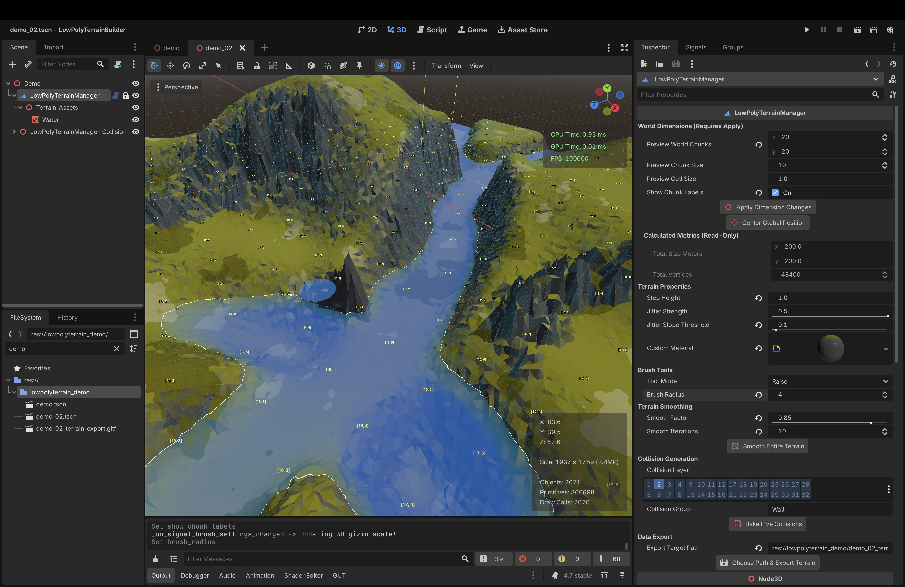

# Low Poly Terrain Builder

An intuitive, optimized, and robust 3D terrain sculpting tool tailored for creating organic
low-poly landscapes inside the Godot 4 editor.

## ✅ **Update information for v1.1.0 (The Server Backend Update):**
Version 1.1.0 adds a second, node-free rendering and physics pipeline alongside the classic one,
together with runtime collision control and a world-space height query.
Key additions:
* Backend Selector: A new 'terrain_backend' option at the top of the inspector picks the pipeline.
* Node-Free Pipeline: SERVERS registers chunks straight with RenderingServer and PhysicsServer3D.
* Lossless Switching: Both backends read the same data, so switching back and forth alters nothing.
* Full Node Parity: Transform, scale, visibility and world membership are mirrored explicitly.
* Group Compatibility: Raycasts still answer 'collider.is_in_group("Wall")' without any glue code.
* Collision Policy: 'runtime_collision' offers PREBUILT (default), LAZY and NONE.
* Retained Colliders: LAZY parks chunks leaving the radius, bounded by 'collision_retain_limit'.
* Culling Targets: Assign nodes to 'collision_cull_targets' and the manager drives the culling.
* Collider Overlay: 'collision_debug_draw' shows live colliders that Godot itself cannot display.
* Runtime Height Query: 'get_height_at_world_coords(x, z)' resolves in O(1) with no physics query.
* Chunk Grid Overlay: 'show_chunk_grid' replaces the per-chunk labels and stays legible at any zoom.
* Chunk Activation Undo: Activate Chunk and Deactivate Chunk strokes are now undoable.
* Brush Handling: The ring hides outside the viewport, and its reach is no longer capped.
* Brush Readout: The caption lists the falloff value, and only the settings the active tool reads.
* Modifier Preview: Holding Shift recolours and recaptions the brush to the tool it will perform.
* Held-Button Sculpting: Holding the mouse button keeps sculpting without moving the cursor.
* Frame-Paced Strokes: The brush applies once per frame instead of once per motion event.
* Resting Strokes: A stroke held on one spot applies at reduced strength instead of full force.
* Brush Silhouette: A coloured outline over a barely tinted disc keeps the terrain readable.
* Visible Chunk Markers: Deactivated chunks read through other terrain, just like the grid does.
* Adjustable Brush Opacity: Two Editor Settings sliders, for terrain the default washes out on.
* Culling Toggle: 'enable_collision_culling' hides the targets and radius where they are unused.
* Rotated Bake Fix: Baked colliders now follow a rotated terrain instead of forming a staircase.
* Ramp Tool: Click two points and a graded slope connects them, at brush width and falloff.
* Configurable Shortcuts: Brush tools ship unassigned to avoid clashing with Godot's viewport keys.
* Shared Geometry Factory: One stateless builder guarantees identical meshes across both backends.
* Uncached Triangle Soups: Colliders and picking avoid the permanent cache inside 'get_faces()'.
* Leaner Chunks: Height windows and preview resources are no longer duplicated per chunk.
* Layer Picker Fix: 'collision_layer' now uses the 3D physics layers instead of the 2D ones.
* Setting Persistence: Inspector-hidden backend settings survive saving and reloading a scene.
* Child Node Safety: Nodes parented to the manager are no longer destroyed on scene start.
* Water Shader: Correct Compatibility-renderer depth and periodic noise without low-speed jitter.
* Cleanup: Removed the unused non-Delaunay mesh generator and the per-chunk 3D labels.

When switching an existing terrain to SERVERS: the baked '<Manager>_Collisions' container is
removed and the bake button is hidden, because bodies are created at runtime instead. Raycast
hits then resolve to the manager rather than to a StaticBody3D.

## ✅ **Update information for v1.0.13 (The Noise Layer & Compatibility Update):**
Version 1.0.13 introduces procedural noise detailing and critical fixes for the OpenGL backend.
Key additions:
* Additive Noise Layering: Injects organic surface details directly onto existing sculpted shapes.
* Zero-Drift Amplitude: Uses a balanced multiplier to keep the average height level stable.
* Chunk-Activity Awareness: Automated safety filters skip deactivated chunks during noise passes.
* Compatibility Renderer Fixes: Resolves rendering artifacts, black spots, and flickering in OpenGL.
* Explicit UV Mapping: Generates native UV coordinates to prevent graphics driver fallbacks.
* Smooth Group Tuning: Forces 'st.set_smooth_group(-1)' to enforce a crisp, artifact-free look.
* Optimized Vertex Pipeline: Re-enables indexing, normals, and tangents to lower GPU overhead.

## ✅ **Update information for v1.0.12 (The Zero-Latency & UI Polish Update):**
Version 1.0.12 brings fluid editing and practical workflow additions.
Key additions:
* Fluid Painting: Optimized chunk activation passes to maintain heavy editor performance.
* Colored Visual Brush Circles: Viewport indicator dynamically updates its color profile.
* 2D Screen Label: Active brush info stays perfectly readable beside the mouse pointer.
* Adjustable Brush Sharpness: Choose between sharp cliff edges and soft, gradual slopes.
* Fixed Plateau Flattening: Flatten tool locks its initial click height across fast movements.

## ✅ **Update information for v1.0.9 (The UI & Workflow Update):**
Version 1.0.9 introduces an overhaul of the user interface and editing ergonomics. 
Key additions:
* a horizontal viewport toolbar
* configurable hotkeys for brush tools and brush radius scaling
* brush radius dependend activation and deactivation of chunks
	
## ✅ **Update information for v1.0.8 (Optimization):**
With v1.0.7, a very resource-intensive (GPU-heavy) default ShaderMaterial was used, causing
frame drops on weaker systems. This issue has been resolved in v1.0.8. I also tested this add-on
on my mobile device, achieving up to 1000 FPS within the editor.




---

## 🚀 Key Features

* **Dynamic Chunk Management:** Grid blocks are handled fluidly without cluttering scene files.
* **Organic Delaunay Topology:** Creates organic triangle networks for typical landscape looks.
* **Integrated Sculpting Brushes:** Includes intuitive Raise, Lower, Flatten, and Smooth tools.
* **Procedural Noise Injector:** Generates seamless Perlin or Cellular landscapes instantly.
* **Ergonomic Viewport Toolbar:** Adds a horizontal radio-button menu with clear SVG icons.
* **Dynamic Color Indicators:** Features a colored 3D brush circle aligned to active tool colors.
* **Crisp 2D Mouse Display:** Shows current tool name, radius, and strength directly at cursor.
* **Laptop-Friendly Radius Control:** Scale your brush radius fluidly using comma and period keys.
* **Production-Ready GLTF Export:** Exports active terrain chunks directly into a standalone asset.
* **Lossless Grid Migration:** Safe resizing of terrain dimensions without losing existing data.
* **Dynamic Live Physics Baking:** Generates static 3D colliders instantly for active sections.
* **Multi-Backend Stability:** Fully optimized for Forward+, Mobile, and Compatibility renderers.
* **Selectable Submission Backend:** Render chunks as nodes or register them with the servers.
* **Radius-Based Collision Culling:** Enables physics near a target without per-collider scans.
* **Full Editor Undo:** Sculpting, noise, smoothing and chunk activation all reverse with Ctrl+Z.

---

## 🧱 Terrain Backend

The **Terrain Backend** setting sits at the very top of the inspector and decides how chunks
reach the engine. Both modes read from the same height data, so switching is lossless in
either direction and can be done at any time.

| | `MESH_NODES` (default) | `SERVERS` |
| :--- | :--- | :--- |
| Rendering | One `MeshInstance3D` child per chunk | `RenderingServer` instance per chunk, no nodes |
| Collision | Baked `StaticBody3D` container next to the manager | `PhysicsServer3D` static bodies, created at runtime |
| Node count | One node per chunk | Zero chunk nodes |
| Draw calls | Identical | Identical |
| Editor selection | Chunks are clickable in the viewport | Chunks are not clickable (see limitations) |

`SERVERS` does **not** reduce draw calls, primitives or GPU frame time. `MeshInstance3D` is a
thin wrapper around the very same `RenderingServer` calls. What it removes is the per-chunk
node: memory, scene-tree transform propagation and rebuild cost. That matters at high chunk
counts and it is what makes cheap streaming possible.

### Frame time

Draw calls, primitives and GPU time are identical by construction, and in a stationary scene
the two backends perform the same. `SERVERS` tends to come out slightly ahead, simply because
there are no chunk nodes for the engine to carry.

There is one case where `SERVERS` is genuinely slower. If the manager, or any ancestor, changes
its transform, every chunk instance has to be re-pushed, and that loop runs in GDScript rather
than in Godot's C++ scene-graph propagation. The gap grows with the chunk count and is
substantial.

The cost applies **once per frame** (Godot coalesces transform notifications) and **only while
the manager is actually moving**. A stationary terrain pays nothing. If you animate a terrain of
several thousand chunks, prefer `MESH_NODES`.

### Memory

Collision, not rendering, dominates the memory profile: a concave collider costs considerably
more than the chunk mesh it was built from, and the totals are driven almost entirely by how
many colliders exist.

Compare like with like: `SERVERS` + `PREBUILT` against **baked** `MESH_NODES`, where it comes
out a little cheaper because the collider nodes are gone. An unbaked `MESH_NODES` terrain has
no collision at all, so it is not a fair baseline.

Colliders are built from the mesh without going through `ArrayMesh.get_faces()`, which caches
its triangle soup inside the mesh permanently. That detail matters more than it sounds: with
the cache in play a released collider gave back almost nothing, so memory under `LAZY` crept
up towards the `PREBUILT` figure as a target explored the world. Built the other way, `LAZY`
stays flat no matter how much of the terrain has been visited, and releasing genuinely
returns the memory.

### SERVERS mode limitations

* Chunks cannot be picked or framed in the editor viewport, because server instances are
  invisible to the editor's click-selection.
* **Bake Live Collisions** is hidden, since `PhysicsServer3D` already provides the physics and
  a baked container would duplicate it. Calling it from code is refused with a message.
* Switching to `SERVERS` removes an existing `<Manager>_Collisions` container, since keeping it
  would duplicate the physics. **`Ctrl+Z` does not bring it back** — switch back to
  `MESH_NODES` and press **Bake Live Collisions** to regenerate it. Nothing is lost: the
  container is derived from the terrain data, not authored content.
* The manager's child count drops to one (`Terrain_Assets`). This is expected, not a defect.
* Game code that checks `collider is StaticBody3D` stops matching, because hits resolve to the
  manager. Check the collision group instead (see below).

---

## 🎯 Collision Culling

Collision is kept loaded only around the things that need it, and there are two ways to drive
that. Both work in either backend.

**Assign a target.** Drop your player into **Collision Cull Targets** in the inspector and you
are done - no glue code at all. The manager follows it once per physics frame and skips the
whole pass while no target has crossed a chunk boundary, so standing still costs nothing.
Several targets are allowed; the loaded region is the union of their radii.

An inspector reference can only point inside the same scene, so a player spawned at runtime is
registered in code instead:

```gdscript
terrain_manager.add_culling_target(player)
terrain_manager.remove_culling_target(player)   # on despawn
```

**Or drive it yourself** with the call the manager uses internally, for example from a level
controller:

```gdscript
func _physics_process(_delta: float) -> void:
	if is_instance_valid(player):
		terrain_manager.update_collision_culling(player.global_position, 40.0)
```

For several centres at once - split-screen players, companion NPCs - the enabled set is the
union of all their radii:

```gdscript
terrain_manager.update_collision_culling_multi(
	[player_a.global_position, player_b.global_position], 40.0
)
```

That is the whole API. Four things are worth knowing about it:

**Positions are world space, the radius is metres.** The manager converts into its own local
space, so a moved, rotated or scaled terrain needs no preparation on your side.

**Call it every physics frame, not sparingly.** There is no internal throttling and none is
needed: affected chunks are derived arithmetically from the regular grid rather than by
measuring the distance to every collider, cost scales with the radius instead of the world
size, and only the delta reaches the physics engine. Calling less often saves almost nothing
and risks gaps.

**Under `LAZY` the radius is lead time, not a display setting.** A collider is *built* on first
contact, inside the physics step, so the radius has to be wide enough that a chunk is finished
before your player arrives. Fast movers need more than walkers.

**Leave `Enable Collision Culling` off while driving it yourself.** It only governs the
automatic target-following pass; with it off the manager runs no `_physics_process` at all, so
you do not pay for a pass you are replacing. Manual calls are unaffected by it.

One asymmetry to watch: `update_collision_culling_multi()` with an **empty** array does
nothing - it does not release anything. If every target disappears and you want the collision
gone, call `update_collision_culling()` with a far-away position, or set `Runtime Collision`
to `NONE`.

### Runtime Collision applies to the SERVERS backend only

> **`PREBUILT`, `LAZY` and `NONE` do nothing in `MESH_NODES`.** They decide when the SERVERS
> backend creates its `PhysicsServer3D` bodies. `MESH_NODES` has no such step: its collision
> comes from `StaticBody3D` nodes you create yourself with **Bake Live Collisions**, and it
> exists from the moment you bake it, whatever `Runtime Collision` is set to.

This is why the setting disappears from the inspector while `MESH_NODES` is active - it is not
missing, it simply has nothing to act on. The value you picked is still stored and comes back
when you switch to `SERVERS`.

Culling itself is a different question and works in **both** backends. In `MESH_NODES` it
toggles `disabled` on the baked `CollisionShape3D` nodes; in `SERVERS` it acts on the body RIDs.
So a `MESH_NODES` terrain can absolutely use **Collision Cull Targets** - it just cannot choose
*when* colliders come into existence, because baking already decided that.

| `runtime_collision` (SERVERS only) | Behaviour of `update_collision_culling()` |
| :--- | :--- |
| `PREBUILT` (default) | Colliders exist everywhere; the radius only enables/disables them. Cheapest to toggle, highest memory. |
| `LAZY` | A collider is **built** the first time a target comes near. Leaving parks it rather than destroying it, so returning is cheap. Lowest memory. |
| `NONE` | No effect; there is no runtime collision. |
| *(MESH_NODES)* | Setting ignored. Culling enables and disables the baked collider nodes. |

### Choosing between PREBUILT and LAZY (SERVERS only)

The two differ in *when* a collider is created, and that is a direct trade of frame time
against memory.

`PREBUILT` builds every collider once and never touches them again. Memory is then
proportional to the **total** number of chunks, and the per-frame cost is nil - the culling
radius only flips colliders on and off, which is close to free.

`LAZY` builds a collider the first time a target comes near the chunk. Memory is then
proportional to the region actually reached rather than to the whole world, which is what
makes very large terrains feasible at all. The price is paid on **first** contact: a concave
shape and its acceleration structure have to be constructed, and that happens inside the
physics step.

Leaving the radius only **parks** a collider - it keeps its shape but takes part in no
collision test - so returning to a chunk costs a flag flip instead of a rebuild. That matters
because a target moving through the world keeps crossing chunks it has already visited.
**Collision Retain Limit** caps how many parked colliders stay resident; beyond it the least
recently parked one is genuinely released. Set it to zero to release immediately instead.

Two rules follow from that:

```
memory        ∝  colliders resident      (all chunks, or the reached region plus parked ones)
frame cost    ∝  chunks reached for the FIRST time per second × cost of building one collider
```

The second one scales with the radius **perimeter** times the target's speed. Enlarging
`collision_cull_radius` therefore makes `LAZY` *more* expensive, not cheaper - it buys
earlier collider availability, not less work. Denser chunks (a larger `chunk_size`) raise the
cost of each individual build, since the shape has more triangles.

| Situation | Recommendation | Reasoning |
| :--- | :--- | :--- |
| The whole terrain's colliders fit in memory | **`PREBUILT`** | Nothing is ever rebuilt, so physics time matches the node backend while the nodes themselves are gone. |
| The terrain is too large for that | **`LAZY`** | Keeping only the reachable region resident is the only way to fit, and is what the policy exists for. |
| Targets move slowly relative to the chunk size | **`LAZY`** | Few chunks enter per second, so the build cost stays negligible. |
| Targets move fast - vehicles, aircraft, teleports | **`PREBUILT`** | A fast mover reaches many new chunks per second, and each first contact pays a full build. |
| Consistent frame times matter more than memory | **`PREBUILT`** | `LAZY` concentrates its work: most frames build nothing, then one frame builds several colliders at once. |
| No gameplay collision needed at all | **`NONE`** | Rendering only, with no physics memory whatsoever. |

If you are unsure, start with `PREBUILT` and only move to `LAZY` once memory actually becomes the
constraint. `PREBUILT` is the default for that reason.

> With `LAZY` something **must** drive the culling - either a target or your own call -
> otherwise the terrain has no collision whatsoever. With neither in place the manager pushes a
> warning two seconds in.

In `MESH_NODES` the call toggles `disabled` on the baked colliders instead, so the same setup
works in both backends. Baking produces a `Static_Chunk_<x>_<z>` body holding a
`Chunk_<x>_<z>_Col` shape, so a collider can be traced back to its chunk from the node name
alone. Scenes baked before that naming still work; the lookup resolves shapes by type.

**Collision Cull Radius** is measured in metres and pre-filled with two chunk edge lengths
(`chunk_size * cell_size * 2`). It is re-derived whenever the terrain dimensions change, but
only while it still matches the previously derived value, so an override you set on purpose is
never overwritten. Bigger is safer: collision has to be present *before* a target arrives, so
fast movers need more lead than walkers. Cost grows with the area, so quadratically.

### Seeing the colliders

Godot's **Debug → Visible Collision Shapes** cannot show `SERVERS` colliders. That feature is
implemented inside `CollisionShape3D`, and this backend deliberately has no such node.

**Collision Debug Draw** fills the gap. It renders the same geometry the built-in view would,
taken straight from `Shape3D.get_debug_mesh()`, as a translucent cyan wireframe:

| Value | Behaviour |
| :--- | :--- |
| `FOLLOW_DEBUG_MENU` (default) | Follows `Debug → Visible Collision Shapes`, exactly like node colliders do. |
| `ALWAYS` | Always drawn, including in a normal run. |
| `NEVER` | Never drawn. |

Because only chunks that actually own a collider light up, this is the direct way to watch
`LAZY` at work: the lit region *is* the culling radius. Turn it off for profiling, since the
wireframe adds line geometry per visible chunk.

---

## 📐 Querying the Terrain at Runtime

```gdscript
var y: float = terrain.get_height_at_world_coords(pos.x, pos.z)
var y2: float = terrain.get_height_at_world_position(pos)     # Y component ignored
if terrain.is_inside_terrain(pos.x, pos.z):
	...
```

`O(1)`: four array reads and three interpolations. No physics query, no geometry, and the same
result in both backends, because it samples the height matrix rather than the generated mesh.
The manager's translation, scale and Y rotation are all accounted for. Coordinates outside the
terrain are clamped to the nearest border height.

**Accuracy.** With `jitter_strength` at `0` the result matches the rendered and collided
surface exactly. Jitter is what introduces error: it displaces mesh vertices sideways while the
height matrix stays on its regular grid, and on a slope a sideways shift reads as a height
difference. Expect roughly

```
error  ≈  jitter_strength × (height change between neighbouring vertices)
```

So the query is exact on unjittered terrain and stays well within a rounding error on gentle
jittered terrain, while a steep jittered slope can drift far enough to matter. A larger
`cell_size` reduces it, since the slope per metre drops. Where that precision is not enough,
use a raycast instead.

### Tilting the terrain is not supported

**Yaw is fine, tilt is not.** Rotating the manager around **Y** is exact, at any angle. Rotating
it around **X** or **Z** breaks every XZ-based query - `get_height_at_world_coords()`,
`get_height_at_world_position()` and `is_inside_terrain()` alike - and the error grows with the
angle rather than staying within any tolerance.

The reason is structural, not a rounding problem. These functions take an X and a Z and have to
pick a point on the vertical world line above them. While the terrain's local Y axis is parallel
to the world Y axis, every point on that line maps to the same grid cell, so the choice does not
matter. Tilt the manager and it does: the line is no longer vertical in local space, each height
along it lands in a different cell, and the lookup answers for the wrong one. A tilted terrain
can also put two surface points above the same XZ position, at which point no single number is
the right answer.

**Build slopes by sculpting, not by tilting.** A ramp is a height gradient, which is exactly what
the height matrix is for - use the **Ramp** brush for it - and then the queries, the colliders
and the brush all keep working. Tilting the manager fights the tool: "Y is up" is baked into the
brush picking, the collision culling and the chunk activation as well, not only into these
queries. The one thing a height matrix genuinely cannot express is an overhang, and no amount of
rotation changes that.

Collision is unaffected either way: baked colliders and server bodies follow the manager's full
transform, tilt included.

---

## ⚙️ Inspector Configuration Parameters

| Property | Group | Type | Description |
| :--- | :--- | :--- | :--- |
| **Terrain Backend** | *(top level)* | `Enum` | `MESH_NODES` creates a `MeshInstance3D` per chunk. `SERVERS` registers chunks directly with `RenderingServer` and `PhysicsServer3D`. |
| **Preview World Chunks** | World Dimensions | `Vector2i` | Map size measured in full grid chunks (X, Z). |
| **Preview Chunk Size** | World Dimensions | `int` | Subdivision density per chunk. Controls details. |
| **Preview Cell Size** | World Dimensions | `float` | Scale size of a single grid square in meters. |
| **Apply Dimension Changes** | World Dimensions | `Button` | Resizes the terrain safely to the new dimensions. |
| **Step Height** | Terrain Properties | `float` | Vertical step height added or removed per brush stroke. |
| **Brush Radius** | Terrain Properties | `int` | Size of the painting tool radius. |
| **Brush Strength** | Terrain Properties | `float` | Multiplier for how fast the terrain deforms. |
| **Brush Falloff Strength** | Terrain Properties | `float` | Blends between sharp linear brush edges (0.0) and soft transitions (1.0). |
| **Jitter Strength** | Terrain Properties | `float` | Intensity of the random vertex displacement for the low-poly look. |
| **Jitter Slope Threshold** | Terrain Properties | `float` | Controls whether flat paths stay plain while hills get unique shapes. |
| **Noise Amplitude** | Noise Generation | `float` | Vertical scale multiplier for balanced height/depth noise distribution. |
| **Terrain Noise** | Noise Generation | `FastNoiseLite` | Target FastNoiseLite resource used for generating organic Perlin/Cellular shapes. |
| **Generate Noise Terrain** | Noise Generation | `Button` | Processes and injects the selected noise pattern into all active chunk vertices. |
| **Show Chunk Grid** | Terrain Properties | `bool` | Overlays a wireframe grid along the chunk boundaries in the editor. One line mesh for the whole terrain, so the cost does not grow with chunk count. |
| **Show Deactivated Chunks** | Terrain Properties | `bool` | Shows or hides semi-transparent red grid boxes over disabled coordinates. |
| **Custom Material** | Terrain Properties | `Resource` | Slot for custom 3D shader or standard materials. |
| **Export Target Path** | Data Export | `String` | Target path where the exported `.gltf` file will be saved. |
| **Choose Path & Export Terrain** | Data Export | `Button` | Opens a file dialog to name and save the model asset. |
| **Runtime Collision** | Collision Generation | `Enum` | **`SERVERS` only**, hidden and inert under `MESH_NODES`, whose collision comes from the bake button instead. Decides *when* a collider is created: `PREBUILT` up front, `LAZY` on first approach, `NONE` never. |
| **Enable Collision Culling** | Collision Generation | `bool` | Master switch for the two settings below. On by default. Works in **both** backends. |
| **Collision Cull Targets** | Collision Generation | `Array[Node3D]` | Nodes the culling follows, typically the player. The manager then drives culling itself once per physics frame. Empty means you drive it manually. |
| **Collision Cull Radius** | Collision Generation | `float` | Metres of collision kept around each target. Pre-filled with `chunk_size * cell_size * 2` and re-derived on dimension changes unless you overrode it. |
| **Collision Retain Limit** | Collision Generation | `int` | `LAZY` only, hidden otherwise. How many colliders outside the radius stay built but parked, so returning to them is cheap. Zero releases immediately. |
| **Collision Debug Draw** | Collision Generation | `Enum` | `SERVERS` only, hidden otherwise. Draws live colliders as a translucent wireframe, since Godot's own Visible Collision Shapes cannot see server bodies. |
| **Collision Layer / Group** | Collision Generation | `Flags / String` | Physics layer mask and custom scene group name for colliders. In `SERVERS` mode the group is applied to the **manager** itself and bodies report the manager as their collider, so `collider.is_in_group("Wall")` keeps working. |

---

## ↩️ Undo / Redo

Every editing operation registers in the editor history and reverses with `Ctrl+Z`:

| Operation | History entry | Stored |
| :--- | :--- | :--- |
| Raise / Lower / Flatten / Smooth brush | `Terrain Sculpt Step` | Sparse delta, only the vertices touched |
| Activate / Deactivate Chunk brush | `Terrain Chunk Activation` | Sparse delta, only the chunks that flipped |
| Generate Noise Terrain | `Generate Noise Terrain` | Full height matrix snapshot |
| Smooth Entire Terrain | `Smooth Entire Terrain` | Full height matrix snapshot |

One brush stroke is one history entry, no matter how many paint events it consists of, and the
delta always holds the state from *before* the stroke began.

**Not covered:** switching the terrain backend. That happens inside a property setter, where
the inspector already has its own history action open, and a nested action does not work there.
Removing the baked collider container therefore cannot be undone — press **Bake Live
Collisions** to regenerate it instead.

---

## ⌨️ Viewport Hotkeys

* **Brush Size:** Hold `,` (Comma) to shrink or `.` (Period) to expand the selection circle seamlessly.
* **Polarity Inversion:** Hold `Shift` during sculpt passes to instantly flip `Raise` into `Lower`.
* **Ramp:** Click once to anchor one end, move the cursor along the preview line, click again to
  build the slope. `Escape` or a right-click drops a pending anchor, as does switching tools.
  Both ends take their height from the terrain, `Brush Radius` sets the width and
  `Brush Falloff Strength` how softly the edges meet the surrounding ground. `Shift` does not
  invert this tool - swapping it between the two clicks would apply something the preview never
  showed. Scriptable as `terrain.apply_ramp(from_world, to_world)`.
* **Tool Swapping:** No key assigned out of the box. Pick your own under
  `Editor Settings > Plugins > Low Poly Terrain Builder > Shortcuts`, then click the toolbar
  buttons or use your key.
* **Brush Visibility:** The ring is drawn as a coloured outline over a faint disc, so the terrain
  underneath stays readable while you sculpt it. Bright terrain can swallow the default, so both
  opacities are adjustable under
  `Editor Settings > Plugins > Low Poly Terrain Builder > Brush`. They apply to every terrain,
  and nothing about them is stored in your scenes.

### Why the tools ship without a shortcut

While a terrain node is selected the plugin sees viewport keys first and consumes the ones it
recognises, so any default would take that key away from Godot for the whole editing session.
The 3D viewport has none to spare: letters drive the tool modes, freelook and the
Blender-style instant transforms, both number rows switch the view, and every modifier fails
somewhere - `Alt` is special-character and dead-key input on macOS and the menu mnemonic on
Windows, `Ctrl` and `Cmd` are reserved, and `Shift` is the freelook speed modifier. Rather than
pick a conflict on your behalf, the plugin leaves the choice to you.

Before assigning a key, check it against Godot's own bindings in
`Editor Settings > Shortcuts`, filtered by `spatial_editor`. That list is authoritative for
your Godot version, where any list reproduced here would not be.

Existing installs keep whatever they already have: a default is only written when the setting
does not exist yet.
